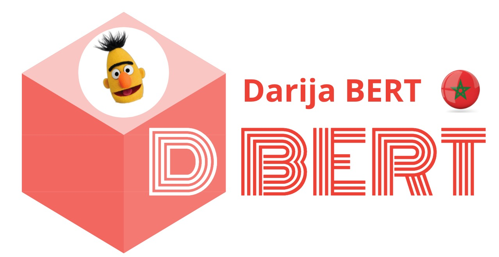

# What is DarijaBERT
<p align="center">
  
</p>
DarijaBERT is the first Open Source BERT model for the Moroccan Arabic dialect called “Darija”. It is based on the same architecture as BERT-base, but without the Next Sentence Prediction (NSP) objective. This model was trained on a total of ~3 Million sequences of Darija dialect representing 691MB of text or a total of ~100M tokens.

# What has been released in this repository?

We are releasing the following :

* PyTorch training code based on HuggingFace trainer 
* Pre-processing code
* WordPiece tokenization code
* Pre-trained model in both PyTorch and TensorFlow versions(future plan)
* Example notebook to finetune the model

# Pretraining data

The model was trained on a dataset issued from three different sources:
* Stories written in Darija scrapped from a dedicated website
* Youtube comments from 40 different Moroccan channels
* Tweets crawled based on a list of Darija keywords. 

Concatenating these datasets sums up to 691MB of text.

# Data preprocessing: 

* Replacing repeated characters with one occurrence of this character
* Replacing hashtags, user mentions and URLs respectively with following words: HASHTAG, USER, URL. 
* Keeping sequences with at least two arabic words
* Removing Tatweel character '\\u0640'
* Removing diacritics
# Pretraining Process

* Same architecture as  [BERT-base](https://github.com/google-research/bert)  was used, but without the Next Sentence Prediction objective.

* Whole Word Masking (WWM)  with a probability of 15% was adopted

* The sequences were tokenized using the  WordPiece Tokenizer from the [Huggingface Transformer library](https://huggingface.co/transformers/). We chose 128 as the maximum length of the input for the model.

* The vocabulary size is 80.000 wordpiece token

The whole training was done on GCP Compute Engine using free cloud TPU v3.8 offered by Google's TensorFlow Research Cloud (TRC) program. It took 49 hours to run the 40 epochs of pretraining.
# Masking task
Since DarijaBERT was treaned using Whole Word Masking, it  is capable of predicting  missing word  in sentence.
```python
from transformers import pipeline
unmasker = pipeline('fill-mask', model='Kamel/DarijaBERT')
unmasker(" اشنو [MASK] ليك ")

{'score': 0.02539043314754963,
  'sequence': 'اشنو سيفطو ليك',
  'token': 25722,
  'token_str': 'سيفطو'},
```

# Downstream tasks 

DarijaBERT was fine tuned on 3 downstream tasks, namely Dialect Identification (DI), Sentiment Analysis (SA), and Topic Modeling (TM). The results were compared to 6 other models, which support arabic either fully or partially:


| Model            | Authors  | Arabic composition | Vocabulary size (Ar/all) | Num Tokens (Ar/all) | Data Size | Num of parameters | Num of Steps | 
| ---------------- | -------  | ------------------ | ------------------------ | ------------------- | --------- | ----------------- | ------------ | 
| XLM-RoBERTa-base | [Conneau et al.](https://aclanthology.org/2020.acl-main.747/)  | Partially (MSA+DA) | 14K/250K                 | 2.9B/295B           |  2.5TB    | 278M              | -            | 
| mBERT-uncased    | [Devlin et al.](https://aclanthology.org/N19-1423/)   | Partially (MSA+DA) | 5K/110K                  | 153M/1.5B           | -         | 167M              | -            | 
| AraBERTv0.2      | [Antoun et al.](https://aclanthology.org/2020.osact-1.2/)   | Fully (MSA)        | 60K/64K                  | 2.5B/2.5B           |  77GB     | 136M              | 3M           | 
| CameL-DA         | [Inoue et al.](https://aclanthology.org/2021.wanlp-1.10.pdf)   | Fully (DA)         | 30K/30K                  | 5.8B/5.8B           |  54GB     | 109M              | 1M           | 
| Qarib            | [Abdelali et al](https://www.researchgate.net/publication/349520378_Pre-Training_BERT_on_Arabic_Tweets_Practical_Considerations)   | Fully (MSA+DA)     | 64K/64K                  | 14B/14B             |  -        | 135M              | 10M          | 
| MarBERT          | [Abdul-Mageed et al.](https://aclanthology.org/2021.acl-long.551/)   | Fully (MSA+DA)     | 100K/100K                | 15.6B/15.6B         |  128GB    | 163M              | 17M          | 
| **DarijaBERT**            | **AIOX LABS\ /SI2M LAB INSEA**  | **Fully (DA)** | **80K/80K**       | **2.9B/295B**           |  **691MB**    | **147M**              | **235k**            | 

## Dialect Identification

This task was conducted on two datasets:
* MSDA dialect detection dataset ([Boujou et al](https://www.researchgate.net/publication/349520583_An_open_access_NLP_dataset_for_Arabic_dialects_Data_collection_labeling_and_model_construction)) : ~50K social media posts in different Arabic dialects, transformed to a binary dataset, Moroccan dialect Vs other dialects
* MADAR ([Bouamor et al.](https://aclanthology.org/L18-1535/) ) :  112K sequences in 25 dialects, transformed to a binary dataset, Moroccan dialect (Rabat and Fes cities)  Vs other dialects

[](https://colab.research.google.com/drive/1drU2CwZLtQ1BYLCuy_wXQhfWyL1ywvmK?usp=sharing)


| Model            | MSDA (F1-score)  | MADAR (F1-score) | 
| ---------------- | ---------------- | ---------------- | 
| XLM-RoBERTa-base | 70.41  | 84.89 |  
| mBERT-uncased    | 76.44  | 90.35 |   
| AraBertv0.2      | 77.90  | 90.32 |  
| CameL-DA         | 80.62  | 92.08 |   
| Qarib            | 81.52  | 92.28 |   
| MarBERT          | 84.25  | 92.00 |   
| DBERT            | **84.48** | **92.87** |


## Sentiment Analysis

In order to detect the sentiment polarity of Moroccan dialect texts, we finetune the model and predict on the MSTD (Moroccan Sentiment Twitter Dataset) dataset ([Mihi et al.](https://thesai.org/Publications/ViewPaper?Volume=11&Issue=10&Code=IJACSA&SerialNo=45) ) composed of  12K tweets labeled as Negative, Objective, Positive or Sarcastic.

We present the sentiment analysis F1-scores obtained with DarijaBERT. We first run the model on the dataset excluding sarcastic tweets, and then including them.
| Model            | MSTD \(macro F1-score)\Positive/Negative/Objective | MSTD \ (F1-score -Sar/macro-)\Positive/Negative/Objective/Sarcasm | 
| ---------------- | ---------------- | ---------------- | 
| XLM-RoBERTa-base | 40.03  | -26.02/32.15- |  
| mBERT-uncased    | 45.00  | -39.21/41.61- |   
| AraBERTv0.2      | 61.42  | -40.70/50.34- |  
| CameL-DA         | 66.04  | -39.44/52.22- |   
| Qarib            |**69.88**  | -36.20/34.85- |   
| MarBERT          | 68.74  | -42.53/53.62- |   
| DarijaBERT            |  69.06   | **-49.32/58.81-** | 

## Topic modeling
Comming soon. 

## Loading the model

The model can be loaded directly using the Huggingface library:
```python
from transformers import AutoTokenizer, AutoModel
DarijaBert_tokenizer = AutoTokenizer.from_pretrained("Kamel/DarijaBERT")
DarijaBert_model = AutoModel.from_pretrained("Kamel/DarijaBERT")
```

Checkpoint for the  Pytorch framework  is  available for downloading in the link below:

https://huggingface.co/Kamel/DarijaBERT

This  checkpoint is  destined exclusively for research, any commercial use should be done with author's permission, please contact via email  at dbert@aiox-labs.com

# Acknowledgments
We gratefully acknowledge Google’s TensorFlow Research Cloud (TRC) program for providing us with free Cloud TPUs.
 
